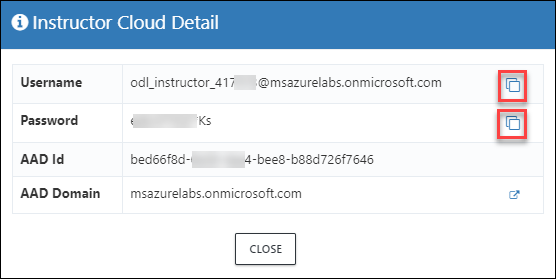
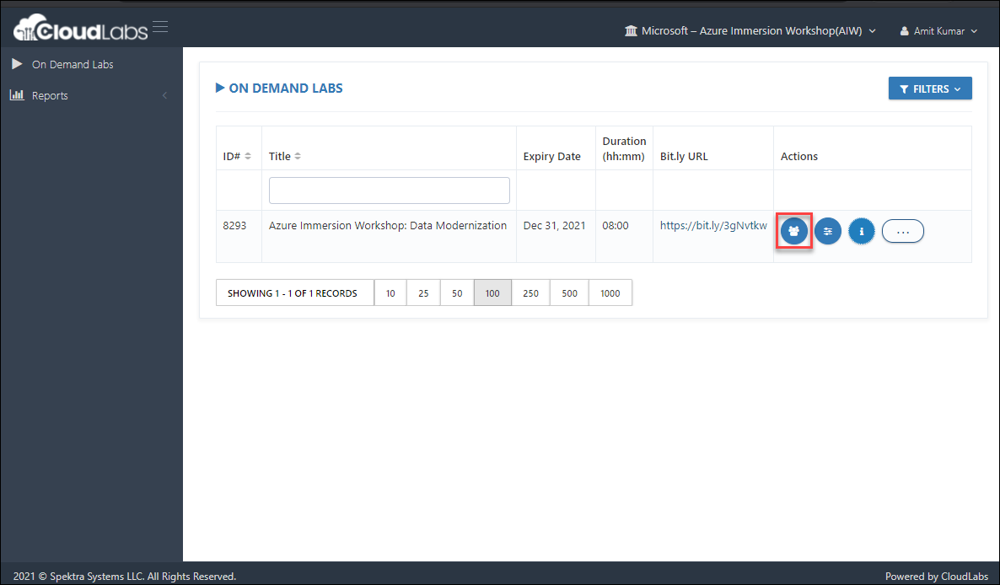

# CloudLabs Shadow

**CloudLabs Shadow** is CloudLabs embedded shadow feature, which normlly shadow the pre-deployed attendees Virtual Machine.
  - Most of the labs hasted on CloudLabs had LabVM/JumpBox, where attedees performs the complete lab.
  - Attendees virtual machine (LabVM/JumBox) can be shadowed and monitored by Instructors in real time.
    * By shadowing the attendees virtual machines (VMs) instructors can help attendees to look and help in troubleshooting the issues. 
    * CloudLabs Support team can assist attedees and instructors during dryrun and actual workshop.
  - It won't disconnect the attendees RDP (Remote Desktop Connection). While instructors are shadowing the session, attedees won't be disconnected from the VM.

### Using CloudLabs Shadow:
Now, shadowing the attendees VM is single button ahead. Here are the steps for shaodwing the attedees VMs using CloudLabs Shadow.
1. Login to https://admin.cloudlabs.ai with your work account (alias@microsoft.com or alias@partner.com).
1. Upon login, on demand lab will be available for management.
   - Ensure to select the right CloudLabs tenant **Microsoft – Azure Immersion Workshop(AIW)** (1)
   - Navigate to **On Demand Labs** (2)
   - On **[Instructor Cloud Details]()** (3) Azure Credentail can be found. With these credentials instructors can access all the attendee’s Azure environment. (3)
   - On **Users** (4) tab already resgitered users can be found and new regitrations can be added in bulk. Also, lab environment and shadowing can be launched from here.
   
   
#### Instructor Cloud Details: 
Azure Credentials are avaiable at instructor cloud details or i button. These Azure credentials will have access to all attendees Azure environment and Instructor can manage the Azure resources of attendees from a single Azure Account.
  
  
#### Users
Navigate to user's tab from actions. Check Deployment ID (DID) for each User (Email).
  - Deployment details for user (you can use azure credentials from this page to access attendee cloud environment).
  - You can manage attendees from this page.
  - Add / Remove attendees.
  - Each attendee is assigned a six-digit unique id to identify lab resource groups and jump VMs.
  

#### Shadow Attendee's Virtual Machine
1. From **Users** tab click on **BINOCULAR** icon to shadow the attendee's VM. A virtual machine session will open in new tab of web browser.
   
1. You will see a Remote Desktop Connection automatically opens (1), that is attendees session shadow. You can Maximize the Sahdow session by clicking on maximize icon (2).
   
  

  
  

 

