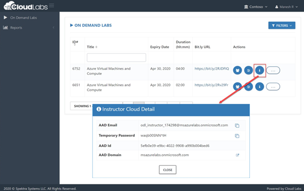
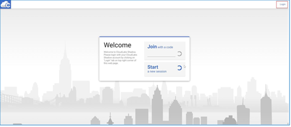
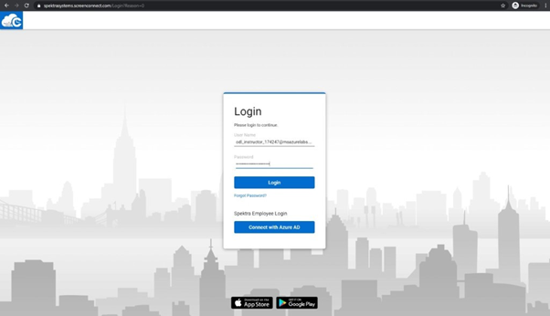

# App Modernization

## Contents

- [How to navigate to the cloud labs portal](#how-to-navigate-to-the-cloud-labs-portal)
- [How to manage users and Unused instances](#how-to-manage-users-and-Unused-instances)
- [Vm Shadowing](#vm-shadowing)
- [RDP Over Https](#rdp-over-https)
- [VM Start/Stop ](#vm-startstop)
- [Instructor Azure Portal Access ](#instructor-azure-portal-access)
- [What do the attendees get when they sign up for the environment](#What-do-the-attendees-get-when-they-sign-up-for-the-environment)
- [Resources that are provided as pre-requisites ](#resourcesthat-are-provided-as-pre-requisites)
- [LAB CONTENTS](#lab-contents)
- [Help Tab](#help-tab)
- [Split Window](#split-window)
- [Collapse Window](#collapse-window)
- [Lab validation](#lab-validation)
- [Known Issues and workarounds ](#known-issues-and-workarounds)
- [FAQ'S](#faqs)

## How to navigate to the cloud labs portal

- Open any browser and navigate to <https://admin.cloudlabs.ai/>  
- Click on sign in and then sign with Work or School Account.  
- Upon login, on demand lab will be available for management. 

   1. Ensure to select the right Cloud Labs tenant. 
   2. Navigate to On Demand Labs, then you will be able to find event ODL name.  
   3. From here you can find instructor credentials. With this credential you can access all the attendee’s azure environments. 
   4. From Users tab, you can find list of lab users with their deployment id. 
   
 
 
## How to manage users and Unused instances

- Navigate to user's tab from actions..  
- From here you can find the list of users with their deployment id and deployment details for each user.  
- You can manage attendees from this page  
- Add / Remove attendees  
- Each attendee is assigned a six-digit unique id to identify lab resource groups and jump VMs 

 

## Features available to instructors

### Vm Shadowing  

- You can shadow multiple attendee VMs at the same time.  
- Multiple instructors / proctors can shadow same attendee VM concurrently.  
- If you don’t see the username upon clicking “Shadow Session”, student may not have launched their Lab VM yet or is disconnected.  

1. Login to [https://admin.cloudlabs.ai](https://admin.cloudlabs.ai/) with your work account (<alias@microsoft.com> or <alias@partner.com>)   
1. Ensure to select the right Cloud Labs tenant (Microsoft – In a Day)  
1. Navigate to On Demand Labs  
1. Using instructor credentials, you can access all the attendee’s azure environments.  
    - Click on information icon from Actions to get Instructor Azure Credentials  
    - Use this username and password to login to Azure portal and CloudLabs Shadow  
    - Login from a private browser instance (InPrivate or Incognito)  

     

1. Navigate to user's tab from actions  
1. You can find the Deployment details for the user here. (you can use azure credentials from this page to access attendee cloud environment)  

   
 
  **SCREEN CONNECT**

1. Navigate to [https://spektrasystems.screenconnect.com](https://spektrasystems.screenconnect.com/)  
1. Click on Login  

   

1. Login with local account, do not choose Azure AD.  
1. Use same username and password provided for Instructor Access  

    
 
    

1. OTP is sent to your work email account. Check and provide the OTP then Login.  
     - Please be sure to check junk/spam folder.  
     - Email is sent out from <cloud@screenconnect.com>  

    

1. Search for specific DID if needed, right Click on Lab User VM (Identified by DID) and Select Shadow Session  

    

1. Select Login Session – demouser or if you see any other username to connect the VM and click on Join Session 

    >Note: If you only see Console and [Backstage], that means attendee is not connected to VM currently  

    

1. Click on Open ScreenConnect Client and install the required software (One Time).  

    
    
1. Shadow users VM session (without overtaking RDP session).

    
1. You can initiate a private chat with attendee by clicking on messaging icon.

    

### RDP Over Https

- Rdp over https is a feature which allows attendees to access the virtual machine over the internet. This eliminates the need of logging in into the vm by attendees.   

- With RDP OVER HTTPS and integrated doc rendering, attendees will be able to see the virtual machine and lab guide on the same screen which makes easier to perform the lab.  

     
 
### VM Start/Stop  

- Attendees can start/stop the Virtual Machine from the Virtual Machine tab. We have provided button to start/stop VM under Actions.  

     
 
### Instructor Azure Portal Access 

Instructor has access to all attendees Resource groups and resources that are pre-deployed or deployed by attendee as a part of the lab. 
1. Instructor can login to the Azure portal with the credentials identified before and will be able to view the resources of all attendees. 

   
 
   
 
1. Since each attendee is assigned with a six-digit Suffix, it is easy for the instructor to view the resources of a particular attendee.  

   To find the attendees details:  

     - From the Cloud Labs portal home page, Click on **On Demand Labs** select the event ODL then click on user's tab from actions. From here, instructor can find the list of attendees with their deployment id and deployment details for each user. 
     - From the list of attendees, instructor can pick the Suffix of the desired attendee and can view the resources from the Azure portal. 

#### How much time does the environment take to get deployed? 

The approximate Duration for deploying a single environment would be 35 minutes. 

### What do the attendees get when they sign up for the environment?  

- As soon as attendee’s environment is deployed, he will be able to see the Lab Description page.  

 

- From the Environment Details tab, attendees can find the Azure Credentials, Virtual Machine Credentials, Service Principal details and other details that are required to perform the lab. 

 

- Scroll down on the Environment Details page and click on the LabVM**-Suffix**   button to login to the Lab VM. 

 

- Then attendee will be able to see a virtual machine in the left to perform the lab and a lab guide in the right which need to be followed throughout the lab. 

 

- Scroll down on the Environment Details page and click on the **GO TO SQL2008-Suffix** button to login to the SQL server VM.  

 

- Then attendee will be able to see a virtual machine in the left to perform the lab and a lab guide in the right which need to be followed throughout the lab. 

 

- Attendee can see the number on lab guide bottom area to switch to different exercises of lab guide.  
- Attendee can also navigate to previous and next exercise using **Previous** and **Next** button. 

 

- From the Virtual Machines tab, attendee can find the available virtual machines, their status (running, pending or deallocated), Uptime, DNS name and can also perform some actions on them. 

  

- Attendee can also perform the following operations on the virtual machine. 

                 1. Start 

                 2. Restart 
     
                 3. Stop and 

                 4. Open the virtual machine in new tab. 

 

- From the Lab Validation tab, attendees can run validation for each exercise after performing it. 

 

### Resources that are provided as pre-requisites. 

Once the attendee login to the Azure portal, following are the Pre-deployed resources that are provided to the attendees to perform the lab. 

   - Resource Group: hands-on-lab-UniqueID 
   - Storage account: contosoUniqueID 
   - Virtual machine (VM): LabVM-UniqueID  
   - SQL VM: Sql2008-UniqueID 
   - Azure SQL Database: ContosoInsurance 
   - Azure Database Migration Service (DMS): contoso-dms-UniqueID 
   - Azure App Service Plan: contoso-asp-UniqueID 
   - App Service (Web App): contoso-web-UniqueID 
   - App Service (API App): contoso-api-UniqueID 
   - Function App: contoso-func-UniqueID 
   - API Management: contoso-apim-UniqueID 
   - Key Vault: contoso-kv-UniqueID 
   - Azure Cognitive Search: contoso-search- 
   - Azure Cognitive Services account: cog-services-UniqueID 
   - Virtual Network: vnet-UniqueID 
   - Networksecuritygroup: jbVirtualMachineName-nsg, sqlVirtualMachineName-nsg 
   - NetworkInterfaces : jbVirtualMachineName-nic, sqlVirtualMachineName-nic 
   - publicIpAddress : jbVirtualMachineName-ip, sqlVirtualMachineName-ip 

 - In the upper left corner of the portal window, click the toggle menu icon and then click on **Resource groups,** then select the **hands-on-lab-Uniqueid** resource group and view the pre-deployed resources**.** 

### Lab Contents 

**Exercise 1: Migrate the on-premises database to Azure SQL Database** 

In this exercise, attendee will use the Microsoft Data Migration Assistant (DMA) to assess the ContosoInsurance database for a migration to Azure SQL Database.  

The assessment generates a report detailing any feature parity and compatibility issues between the on-premises database and Azure SQL Database. 

**Exercise 2: Post upgrade database enhancements** 

In this exercise, attendee will explore through the some of the security features of Azure SQL Database, and review some of the security benefits that come with running your database in Azure.  

**Exercise 3: Configure Key Vault** 

In this exercise, attendee will configure Azure Key Vault, which securely stores application secrets for the Contoso web and API applications, once migrated to Azure. 

**Exercise 4: Deploy Web API into Azure App Services** 

In this task, attendee will apply application settings to the Web API using the Azure Portal. Once the application settings have been set, you deploy the Web App and API App into Azure from Visual Studio. 

**Exercise 5: Deploy web application into Azure App Services** 

In this exercise, attendee updates the Contoso.Web web application to connect to your newly deployed API App by adding API App URL to Web App Application settings and then deploy the web app into Azure App Services.** 

**Exercise 6: Upload policy documents into blob storage** 

In this exercise, attendee will provide a storage account to store the files in a blob container then provides a way to bulk upload their existing PDFs 

**Exercise 7: Create serverless API for accessing PDFs** 

In this exercise, you create an Azure Function to enable an API solution that allows the users of Contoso application to retrieve their policy documents directly from their Azure Storage account using serverless technologies. 

**Exercise 8: Add Cognitive Search for policy documents** 

In this exercise, attendee will configure the cognitive search for the policies blob storage container which provides the ability to perform full-text searching on policy documents. 

**Exercise 9: Create an app in PowerApps** 

In this exercise, attendee will a new app in PowerApps, which connects to the ContosoInsurance database and performs basic CRUD (Create, Read, Update, and Delete) operations against the Policies table. 

### Lab validation

After performing each exercise, the attendees are asked to run validation for the provided tasks to ensure that the expected output is obtained. 

1. Expand lab validation details and click on validate button. 

 

2. Attendees can find the validation status either Succeeded or failed under status tab 

`                  `If the validation fails, it will give the error message regarding why the validation has failed so that attendee can find the mistake which he committed and rectify it accordingly. 

`   ` 

### Help Tab

1. Expand **More** button on the right and click on **Help**.  

    

1. From Help tab, attendees can find the common issues such as copy-paste, pop-up visibility issues and solutions to resolve them. 

    

### Split Window

- Split window will open the lab guide in new Window by providing the only virtual machine on the current window. 

    
 

### Collapse Window

1. Collapse button will collapse the lab guide window and provides the full view of the virtual machine.  

    

2. Attendee can get back the lab guide when needed by clicking on Expand button. 

    
    

#### Average time taken to complete the lab: 8 hours 

### Known Issues/Workarounds 

## FAQ’S: 

#### How to access lab environment 

1. Instructor share the bit.ly link and activation code during the event to attendees. 

             DO NOT share the activation details prior to session (Lab Start time) 

1. All attendees activate the lab instance using the same activation code. 

    
    
- Attendee will navigate to the bit.ly link and provide the required details. 

- Its mandatory to give company email address and actual organization name. 

    

- Once lab instance is assigned, details are also sent to attendee via email from [noreply@cloudlabs.ai 
  ](mailto:noreply@cloudlabs.ai) 
  
1. Once attendee register using Lab activation details, he will click on **Launch Lab** to get started with the lab. 

    

1. Once the deployment is succeeded, attendee will get the screen with the lab guide, Environment Details (Azure Credentials), etc. on the Right Side and Virtual Machine on the Left. 

     

How to find the **UniqueID** Value: 

Attendee can find the UniqueID value by navigating to **Environment Details** page then selecting Azure Credentials tab. 

   

How to find the **SERVICE PRINCIPAL** Details: 

Attendee can find the service principal details by navigating to **Environment Details** page then selecting Service Principal tab. 

   

