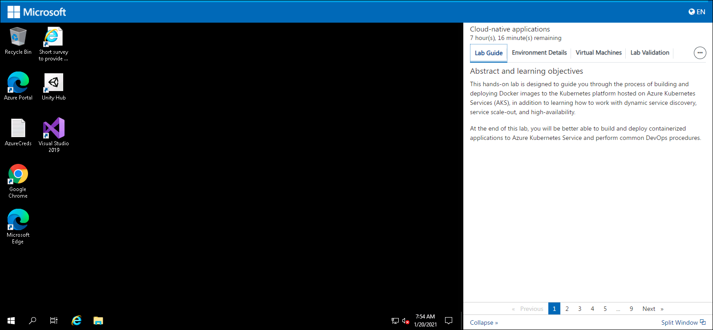
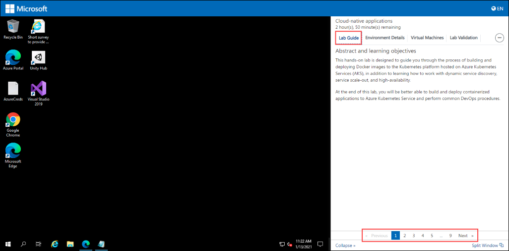
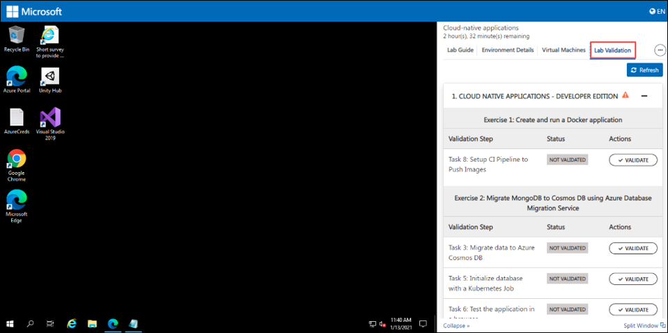
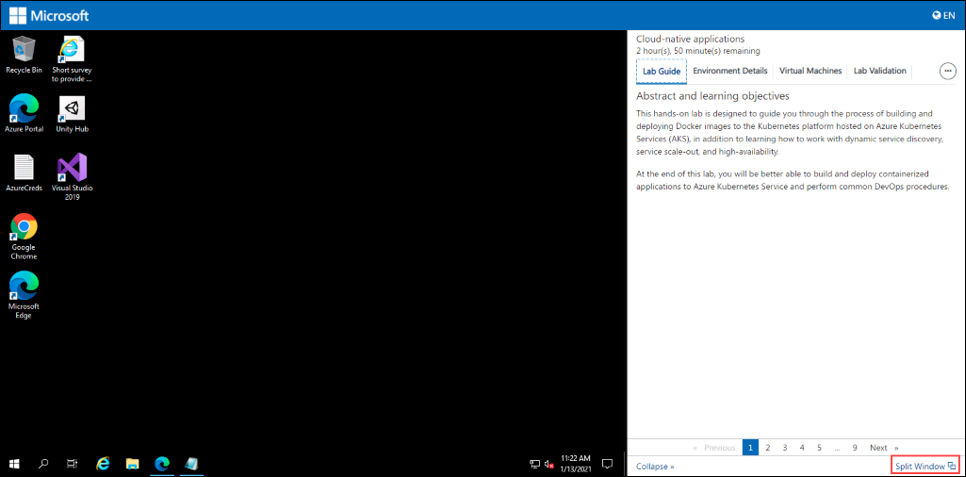
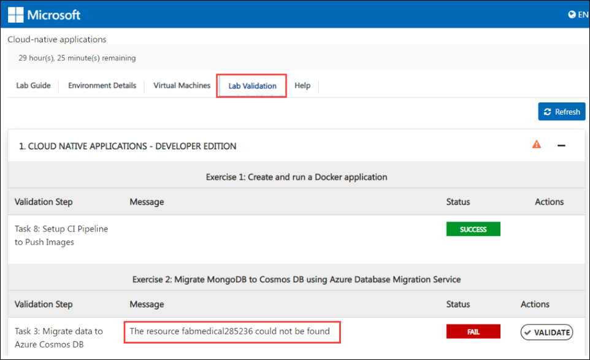
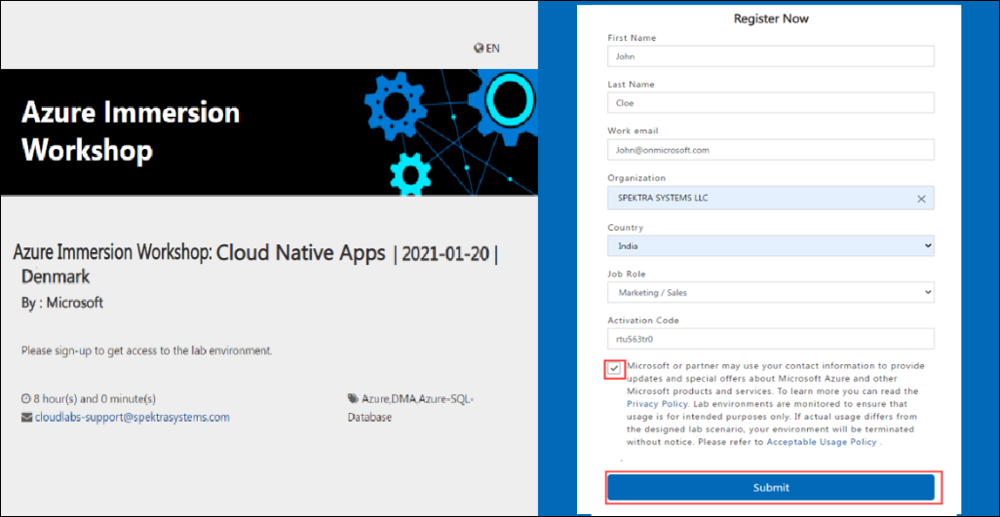
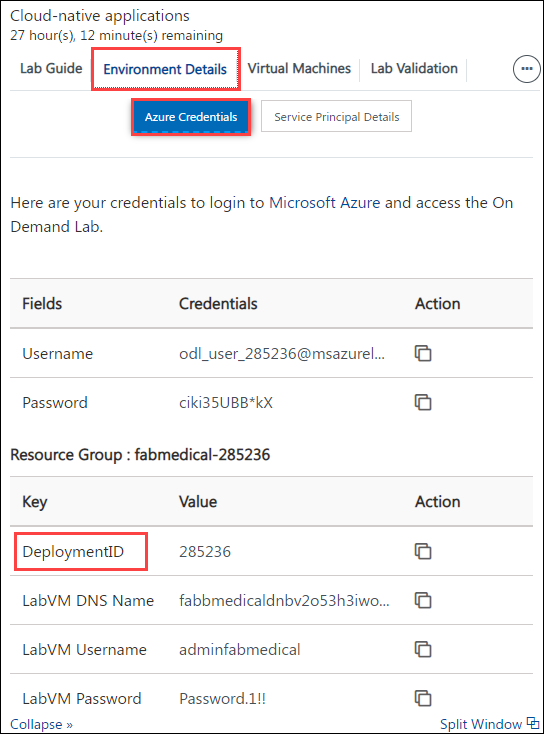
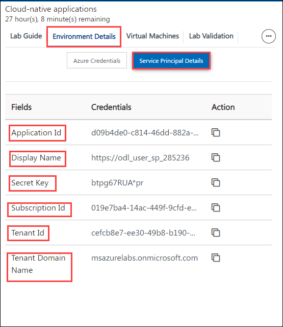

# Cloud Native Applications

## Contents

- [How to navigate to the cloud labs portal](#how-to-navigate-to-the-cloud-labs-portal)
- [How to manage users and Unused instances](#how-to-manage-users-and-Unused-instances)
- [Vm Shadowing](#vm-shadowing)
- [RDP Over Https](#rdp-over-https)
- [VM Start/Stop ](#vm-startstop)
- [Instructor Azure Portal Access ](#instructor-azure-portal-access)
- [What do the attendees get when they sign up for the environment](#What-do-the-attendees-get-when-they-sign-up-for-the-environment)
- [Help Tab](#help-tab)
- [Split Window](#split-window)
- [Collapse Window](#collapse-window)
- [Resources that are provided as pre-requisites ](#resources-that-are-provided-as-pre-requisites)
- [Lab Contents](#lab-contents)
- [Lab validation](#lab-validation)
- [Known Issues and workarounds ](#known-issues-and-workarounds)
- [FAQ'S](#faqs)

## How to navigate to the cloud labs portal

- Open any browser and navigate to <https://admin.cloudlabs.ai/>  
- Click on sign in and then sign with Work or School Account.  
- Upon login, on demand lab will be available for management. 

   1. Ensure to select the right Cloud Labs tenant. 
   2. Navigate to On Demand Labs, then you will be able to find event ODL name.  
   3. From here you can find instructor credentials. With this credential you can access all the attendee’s azure environments. 
   4. From Users tab, you can find list of lab users with their deployment id. 
   
 
 
## How to manage users and Unused instances

- Navigate to user's tab from actions..  
- From here you can find the list of users with their deployment id and deployment details for each user.  
- You can manage attendees from this page  
- Add / Remove attendees  
- Each attendee is assigned a six-digit unique id to identify lab resource groups and jump VMs 

 

## Features available to instructors

### Vm Shadowing  

- You can shadow multiple attendee VMs at the same time.  
- Multiple instructors / proctors can shadow same attendee VM concurrently.  
- If you don’t see the username upon clicking “Shadow Session”, student may not have launched their Lab VM yet or is disconnected.  

1. Login to [https://admin.cloudlabs.ai](https://admin.cloudlabs.ai/) with your work account (<alias@microsoft.com> or <alias@partner.com>)   
1. Ensure to select the right Cloud Labs tenant (Microsoft – In a Day)  
1. Navigate to On Demand Labs  
1. Using instructor credentials, you can access all the attendee’s azure environments.  
    - Click on information icon from Actions to get Instructor Azure Credentials  
    - Use this username and password to login to Azure portal and CloudLabs Shadow  
    - Login from a private browser instance (InPrivate or Incognito)  

     

1. Navigate to user's tab from actions  
1. You can find the Deployment details for the user here. (you can use azure credentials from this page to access attendee cloud environment)  

   
 
   SCREEN CONNECT  

1. Navigate to [https://spektrasystems.screenconnect.com](https://spektrasystems.screenconnect.com/)  
1. Click on Login  

   

1. Login with local account, do not choose Azure AD.  
1. Use same username and password provided for Instructor Access  

    
 
    

1. OTP is sent to your work email account. Check and provide the OTP then Login.  
     - Please be sure to check junk/spam folder.  
     - Email is sent out from <cloud@screenconnect.com>  

    

1. Search for specific DID if needed, right Click on Lab User VM (Identified by DID) and Select Shadow Session  

    

1. Select Login Session – demouser or if you see any other username to connect the VM and click on Join Session 

    >Note: If you only see Console and [Backstage], that means attendee is not connected to VM currently  

    

1. Click on Open ScreenConnect Client and install the required software (One Time).  

    
    
1. Shadow users VM session (without overtaking RDP session).

    
1. You can initiate a private chat with attendee by clicking on messaging icon.

    

### RDP OVER HTTPS  

- Rdp over https is a feature which allows attendees to access the virtual machine over the internet. This eliminates the need of logging in into the vm by attendees.   

- With RDP OVER HTTPS and integrated doc rendering, attendees will be able see the virtual machine and lab guide on the same screen which makes easier to perform the lab.  

    
    
### VM Start/Stop  

- Attendees can start/stop the Virtual Machine from the Virtual Machine tab. We have provided button to start/stop VM under Actions.  

    
    
### Instructor Azure Portal Access 

1. Instructor has access to all attendees Resource groups and resources that are pre-deployed or deployed by attendee as a part of the lab. 

1. Instructor can login to the Azure portal with the credentials identified before and will be able to view the resources of all attendees. 

   
 
   

1. Since each attendee is assigned with a six-digit Suffix, it is easy for the instructor to view the resources of a particular attendee.  
    
    To find the attendees details:  
    
      - From the Cloud Labs portal home page, Click on **On Demand Labs** select the event ODL then click on user's tab from actions. From here, instructor can find the list of attendees with their deployment id and deployment details for each user. 
      - From the list of attendees, instructor can pick the Suffix of the desired attendee and can view the resources from the Azure portal. 
      
## How much time does the environment take to get deployed? 

The approximate Duration for deploying a single environment would be 30 minutes. 

## What do the attendees get when they sign up for the environment.  

1. As soon as the attendee’s environment is deployed, he will be able to see a virtual machine on the left which will be used to perform the lab. 

 1. On the right, Attendee will be able to find 

     1. A lab guide, which should be followed to perform the lab.  

          - Attendee can see the number on lab guide bottom area to switch to different exercises of lab guide.  

          - Attendee can also navigate to previous and next exercise using Previous and Next button. 
             
          
           
     1. Environment Details which include user credentials (Azure Credentials), Virtual Machine Credentials and other details. 
     
          

     1. Virtual Machines tab, attendee can find the available virtual machines, their status (running, pending or deallocated), Uptime and can also perform some actions on them.

          

          - Attendee can also perform the following operations on the virtual machine. 

               1. Start 

               2. Restart and

               3. Stop  

           
          
     1. From the Lab Validation tab, attendees can run validation for each exercise after performing it. 

            

### Help Tab 

1. Expand **More** button on the right and click on **Help**. 

    

1. From the Help tab, attendees can find the common issues such as copy-paste, pop-up visibility issues and solutions to resolve them. 

    
    
### Split Window

- Split window will open the lab guide in new Window by providing only virtual machine on the current window. 

    

### Collapse Window

1. The collapse button will collapse the lab guide window and provide a full view of the virtual machine.  

    

1. Attendee can get back the lab guide when needed by clicking on Expand button. 

    
    

## Resources that are provided as pre-requisites. 

Once the attendee login to the Azure portal, following are the Pre-deployed resources that are provided to the attendees to perform the lab. 

   - Resource Group : fabmedical-DeploymentID 
   - Resources deployed in fabmedical-DeploymentID: 
   
       - Virtual machine: fabmedical 
       - virtualNetwork : fabmedical-vnet 
       - Networksecuritygroup : fabmedical-nsg 
       - NetworkInterfaces : fabmedical-DeploymentID 
       - publicIpAddress: fabmedical-ip 
       - Container registry: acrDeploymentID 
       - Kubernetes Service : fabmedical-DeploymentID 
       - Log analytics workspace : fabmedical-DeploymentID 
       - Application insights : Content-web and Content-api 
       - Cosmos DB : fabmedical-DeploymentID 

   - In the upper left corner of the portal window, click the toggle menu icon and then click on **Resource groups,** then select the **fabmedical-DeploymentID** resource group and view the pre-deployed resources**.** 

### Lab Contents

**Exercise 1: Create and run a Docker application**

In this exercise, attendee will take the starter files and run the node.js application as a Docker application. Attendee will create a Docker file, build Docker images, and run containers to execute the application. 

**Exercise 2: Migrate MongoDB to Cosmos DB using Azure Database Migration Service**

At this point, attendee have the web and API applications running in Azure Kubernetes Service. The next, step is to migrate the MongoDB database data over to Azure Cosmos DB. This exercise will use the Azure Database Migration Service to migrate the data from the MongoDB database into Azure Cosmos DB. 

**Exercise 3: Deploy the solution to Azure Kubernetes Service**

In this exercise, attendee will connect to the Azure Kubernetes Service cluster that is pre-created as a part of pre-requisite and deploy the Docker application to the cluster using Kubernetes. 

**Exercise 4: Scale the application and test HA**

At this point, attendee had deployed a single instance of the web and API service containers. In this exercise, he will increase the number of container instances for the web service and scale the front-end on the existing cluster. 

**Exercise 5: Working with services and routing application traffic**

In the previous exercise, we introduced a restriction to the scale properties of the service. In this exercise, attendee will configure the api deployments to create pods that use dynamic port mappings to eliminate the port resource constraint during scale activities. 

## Lab validation

After performing each exercise, the attendees are asked to run validation for the provided tasks to ensure that the expected output is obtained. 

1. Expand lab validation details and click on validate button. 

    
    
2. Attendees can find the validation status either Succeeded or failed under status tab. 
- If the validation fails, it will give the error message regarding why the validation has failed so that attendee can find the mistake which he committed and rectify it accordingly. 

    

#### Average time taken to complete the lab: 8 hours 

### Known Issues and workarounds

1. Instructor should make sure that the attendees follow the **lab guide** provided in the environment to perform the lab instead of lab guide from MCW repo. Because few instructions may differ from the provided lab guide and MCW repo lab guide. 

1. Attendees should make sure that they will go through every instruction properly while performing the before hands-on-lab. If at all the lab guide is not followed correctly, attendees will be facing issues in next part of the lab. 

1. Yaml files 

   While **editing or inserting** the content into the yaml files, attendees should make sure they read the instructions properly and edit the files accordingly. It is better to cross check the files once, after editing and before saving them. 

1. If attendee’s session to build agent vm gets disconnected,  

   To reconnect to the vm, follow the instruction provided in the before hands-on-lab. 

    1. From Environment details page go to **Command to Connect to Build Agent VM** copy the ssh key and paste in cloud shell. 
    2. In the cloud shell output, paste the ssh key that you copied earlier enter **yes** when prompted. 
    3. Enter the Buid Agent VM password provided in environment details, you will be connected to Build Agent VM. 

1. Issue in before hands-on-lab task 3 step13 

    - When the attendee faces an issue while pushing the changes to the master branch, make sure the GitHub repo URL and the provided credentials are correct. Then ask the attendee to rerun the command **git push -u origin master** to push the changes. 

1. Issues in Exercise 1 due to unsuccessful cloning of **Fabmedical** repo. 

    - Ask attendee to verify that whether he had cloned the **Fabmedical** repository properly. If   not, ask the attendee to run the command,  **git clone <GITHUB\_REPOSITORY\_URL>** to clone the **Fabmedical** repo and perform the step again. 

1. Exercise1 Task1 Step17: 

   - If attendee get **no such file or directory** error, run the command  **ng build** , and retry step 17 
   
1. Exercise1 task9:  

   - If the Workflow execution fails follow the below instruction to resolve the issue. 
   
        - Make sure that attendee has provided the correct values for resourceGroupName, containerRegistryName and containerRegistry correctly. Then ask attendee to run the workflow again. 
 
   Even after providing the correct values if workflow fails,follow the below steps: 
   
     - Go to cloud shell and open content-web.yml by running the command vi content-web.yml.   
     - In the browser open a new tab and navigate to <https://raw.githubusercontent.com/CloudLabs-MCW/MCW-Cloud-native-applications/fix/Hands-on%20lab/content-web.yml>.   
     - Copy the content till the line ${{ env.containerRegistry }}/${{ env.imageRepository }}:latest, switch back to cloud shell and replace the existing content with the copied content. Make sure to replace [SUFFIX] with your DeploymentId.   
     - Now redo the steps from 10-14. 
     
1. Issue while using Kubernetes Dashboard 

   - If attendee lose the connection to Kubernetes dashboard, he should run the command again in Cloud Shell to re-establish the connection.  

   - If the Kubernetes dashboard becomes unresponsive in the browser this is an indication to return cloud shell and check your tunnel or rerun the command. 

   - If attendee is facing the issue as mentioned in the below screenshot. Follow any one of the provided solutions to resolve the issue. 

         

       - Then ask the attendee to click on the "user/profile" icon in the upper-right of the dashboard, select "Sign out", then sign back into the K8s dashboard and it will work again.  

      - Restart the cloud shell and rerun the command to establish the connection then browse to the Kubernetes dashboard. 

1. Issue in Exercise 2 Task 2 Step 4 

   When adding migration project if attendee gets the error “the connection timed out. Possible reasons for this include 

     - the address and/or port was not correct, or the server is not running.” its temporary issue wait for 5-10 minutes then retry again 

1. Exercise 5 Task3 Step6: 

   - Even after increasing CPU to 125m, if scaling of pods fails with error “invalid syntax and insufficient CPU”. Follow the below steps. 

## FAQ’s 

#### How to access lab environment

1. Instructor share the bit.ly link and activation code during the event to attendees. 

    DO NOT share the activation details prior to session (Lab Start time) 

1. All attendees activate the lab instance using the same activation code. 

    

1. Attendee will navigate to the bit.ly link and provide the required details. 

1. Its mandatory to give company email address and actual organization name. 

    
        
1. Once lab instance is assigned, details are also sent to attendee via email from [noreply@cloudlabs.ai 
  ](mailto:noreply@cloudlabs.ai) 
  
1. Once attendee register using Lab activation details, he will click on Launch Lab to get started with the lab. 

   
    
1. Once the deployment is succeeded, attendee will get the screen with the lab guide, Environment Details (Azure Credentials), etc. on the Right Side and Virtual Machine on the Left. 

     
    

#### How to find the DeploymentID Value: 

- Attendee can find the DeploymentID value under Resource group by navigating to **Environment Details** page then selecting Azure Credentials tab. 

     

#### How to find the **SERVICE PRINCIPAL** Details: 

- Attendee can find the service principal details by navigating to **Environment Details** page then selecting Service Principal tab. 

     
    
