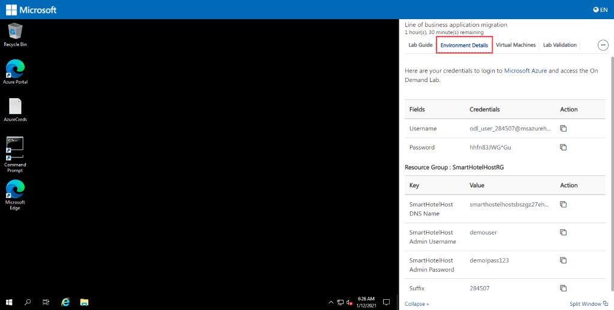
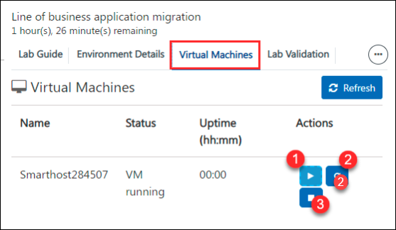
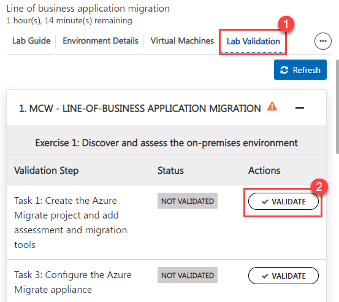
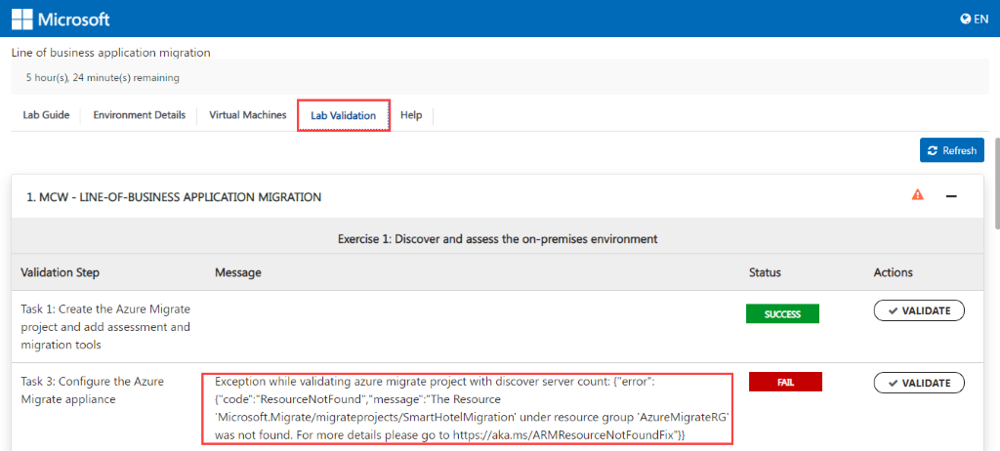
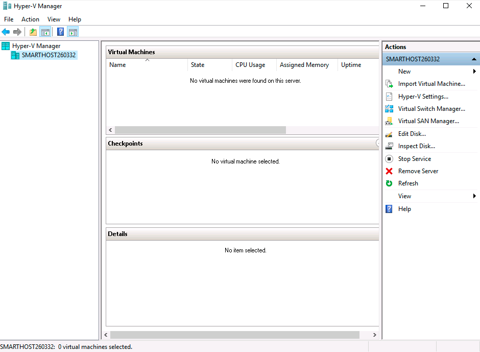

# Infrastructure Migration

## Contents

- [How to navigate to the cloud labs portal](#how-to-navigate-to-the-cloud-labs-portal)
- [How to manage users and Unused instances](#how-to-manage-users-and-Unused-instances)
- [Vm Shadowing](#vm-shadowing)
- [RDP Over Https](#rdp-over-https)
- [VM Start/Stop ](#vm-startstop)
- [Instructor Azure Portal Access ](#instructor-azure-portal-access)
- [What do the attendees get when they sign up for the environment](#What-do-the-attendees-get-when-they-sign-up-for-the-environment)
- [Help Tab](#help-tab)
- [Split Window](#split-window)
- [Collapse Window](#collapse-window)
- [Resources that are provided as pre-requisites ](#resources-that-are-provided-as-pre-requisites)
- [LAB CONTENTS](#lab-contents)
- [Lab validation](#lab-validation)
- [Known Issues and workarounds ](#known-issues-and-workarounds)
- [FAQ'S](#faqs)

## How to navigate to the cloud labs portal

- Open any browser and navigate to <https://admin.cloudlabs.ai/>  
- Click on sign in and then sign with Work or School Account.  
- Upon login, on demand lab will be available for management. 

   1. Ensure to select the right Cloud Labs tenant. 
   2. Navigate to On Demand Labs, then you will be able to find event ODL name.  
   3. From here you can find instructor credentials. With this credential you can access all the attendee’s azure environments. 
   4. From Users tab, you can find list of lab users with their deployment id. 
   
 
 
## How to manage users and Unused instances

- Navigate to user's tab from actions..  
- From here you can find the list of users with their deployment id and deployment details for each user.  
- You can manage attendees from this page  
- Add / Remove attendees  
- Each attendee is assigned a six-digit unique id to identify lab resource groups and jump VMs 

 

## Features available to instructors

### Vm Shadowing  

- You can shadow multiple attendee VMs at the same time.  
- Multiple instructors / proctors can shadow same attendee VM concurrently.  
- If you don’t see the username upon clicking “Shadow Session”, student may not have launched their Lab VM yet or is disconnected.  

1. Login to [https://admin.cloudlabs.ai](https://admin.cloudlabs.ai/) with your work account (<alias@microsoft.com> or <alias@partner.com>)   
1. Ensure to select the right Cloud Labs tenant (Microsoft – In a Day)  
1. Navigate to On Demand Labs  
1. Using instructor credentials, you can access all the attendee’s azure environments.  
    - Click on information icon from Actions to get Instructor Azure Credentials  
    - Use this username and password to login to Azure portal and CloudLabs Shadow  
    - Login from a private browser instance (InPrivate or Incognito)  

     

1. Navigate to user's tab from actions  
1. You can find the Deployment details for the user here. (you can use azure credentials from this page to access attendee cloud environment)  

   
 
   SCREEN CONNECT  

1. Navigate to [https://spektrasystems.screenconnect.com](https://spektrasystems.screenconnect.com/)  
1. Click on Login  

   

1. Login with local account, do not choose Azure AD.  
1. Use same username and password provided for Instructor Access  

    
 
    

1. OTP is sent to your work email account. Check and provide the OTP then Login.  
     - Please be sure to check junk/spam folder.  
     - Email is sent out from <cloud@screenconnect.com>  

    

1. Search for specific DID if needed, right Click on Lab User VM (Identified by DID) and Select Shadow Session  

    

1. Select Login Session – demouser or if you see any other username to connect the VM and click on Join Session 

    >Note: If you only see Console and [Backstage], that means attendee is not connected to VM currently  

    

1. Click on Open ScreenConnect Client and install the required software (One Time).  

    
    
1. Shadow users VM session (without overtaking RDP session).

    
1. You can initiate a private chat with attendee by clicking on messaging icon.

    

### RDP OVER HTTPS  

- Rdp over https is a feature which allows attendees to access the virtual machine over the internet. This eliminates the need of logging in into the vm by attendees.   

- With RDP OVER HTTPS and integrated doc rendering, attendees will be able see the virtual machine and lab guide on the same screen which makes easier to perform the lab.  

    
    
### VM Start/Stop  

- Attendees can start/stop the Virtual Machine from the Virtual Machine tab. We have provided button to start/stop VM under Actions.  

    
    
### Instructor Azure Portal Access 

1. Instructor has access to all attendees Resource groups and resources that are pre-deployed or deployed by attendee as a part of the lab. 

1. Instructor can login to the Azure portal with the credentials identified before and will be able to view the resources of all attendees. 

   
 
   

1. Since each attendee is assigned with a six-digit Suffix, it is easy for the instructor to view the resources of a particular attendee.  
    
    To find the attendees details:  
    
      - From the Cloud Labs portal home page, Click on **On Demand Labs** select the event ODL then click on user's tab from actions. From here, instructor can find the list of attendees with their deployment id and deployment details for each user. 
      - From the list of attendees, instructor can pick the Suffix of the desired attendee and can view the resources from the Azure portal. 

## How much time does the environment take to get deployed? 

The approximate Duration for deploying a single environment would be 120 minutes. 

## What do the attendees get when they sign up for the environment.  

1. As soon as the attendee’s environment is deployed, he will be able to see a virtual machine on the left which will be used to perform the lab. 

 1. On the right, Attendee will be able to find 

     1. A lab guide, which should be followed to perform the lab.  

          - Attendee can see the number on lab guide bottom area to switch to different exercises of lab guide.  

          - Attendee can also navigate to previous and next exercise using Previous and Next button. 
             
          
           
     1. Environment Details which include user credentials (Azure Credentials), Virtual Machine Credentials and other details. 
     
          

     1. Virtual Machines tab, attendee can find the available virtual machines, their status (running, pending or deallocated), Uptime and can also perform some actions on them.

          

          - Attendee can also perform the following operations on the virtual machine. 

               1. Start 

               2. Restart and

               3. Stop  

           
          
     1. From the Lab Validation tab, attendees can run validation for each exercise after performing it. 

            

### Help Tab

1. Expand **More** button on the right and click on **Help**.  

    
    
2. From Help tab, attendees can find the common issues such as copy-paste, pop-up visibility issues and solutions to resolve them. 

    
   
   
### Split Window

- Split window will open the lab guide in new Window by providing the only virtual machine on the current window. 

    

### Collapse Window

1. Collapse button will collapse the lab guide window and provides the full view of the virtual machine.  

    
    
2. Attendee can get back the lab guide when needed by clicking on Expand button. 

     

**Average time taken to complete the lab: 8 hours** 

## Resources that are provided as pre-requisites. 

Once the attendee logs in to the Azure portal, the following are the Pre-deployed resources that are provided to the attendees to perform the lab. 

   - Resource Groups: 
      - AzureMigrateRG 
      - SmartHotelDBRG 
      - SmartHotelHostRG 
      - SmartHotelRG and 
      - BastionRG 
      - NetworkWatcherRG 

   - Resources deployed in SmartHotelHostRG : 

      - Virtual machine:  SmarthostSuffix 
      - Virtual Network: smarthotelhostvnet, DMSvnet 
      - Networksecuritygroup: smarthotelhostnsg 
      - NetworkInterfaces: smarthotelhostnic 
      - publicIpAddress: smarthotelhostip 

  - In the upper left corner of the portal window, click the toggle menu icon and then click on **Resource groups,** then select the **SmartHotelHostRG** resource group and view the pre-deployed resources**.** 

### LAB CONTENTS

**Exercise 1: Discover and assess the on-premises environment** 

- In this exercise, attendee will use **Azure Migrate: Server Assessment** to assess the on-premises environment.  
- This includes selecting Azure Migrate tools, deploying the Azure Migrate appliance into the on-premises environment, creating a migration assessment, and using the Azure Migrate dependency visualization. 

**Exercise 2: Migrate the Application Database** 

- In this exercise, attendee will migrate the application database from the on-premises Hyper-V virtual machine to a new database hosted in the Azure SQL Database service. 
- Attendee will use the Azure Database Migration Service to complete the migration, which uses the SQL Server Data Migration Assistant for the database assessment and schema migration phases. 

**Exercise 3: Migrate the application and web tiers using Azure Migrate: Server Migration** 

- In this exercise, attendee will migrate the web tier and application tiers of the application from on-premises to Azure using **Azure Migrate: Server Migration**. 
- Having migrated to the virtual machines, attendee will reconfigure the application tier to use the application database hosted in Azure SQL. This will enable you to verify that the migration application is working end-to-end. 

### Lab validation

After performing each exercise, the attendees are asked to run validation for the tasks provided to ensure that the expected output is obtained. 

1. Expand lab validation details and click on the validate button. 

    

2. Attendees can find the validation status either Success or failed under status tab. 

    - If the validation fails, it will give the error message regarding why the validation has failed so that the attendee can find the mistake which he committed and rectify it accordingly. 

     

#### Average time taken to complete the lab: 8 hours 

## Known issues and workarounds

### Important!! 

Whenever attendee is asked to provide value for **SUFFIX**, it should be replaced with value which can be found from the Environment Details page. Not providing the SUFFIX value will lead to **Deployment issues** while deploying new resources. 

Wherever attendee is asked to provide value for **Location** same as your Azure SQL Database, make sure to select the same region because selecting the different region will not allow the replication and migration of resources. 

Exercise1 Task2 Step2: 

If an attendee is not able to see the virtual machines in the Hyper-V manager  

   

he can wait for 5-10 minutes and refresh the browser the attendee will be able to see the 4 virtual machines in the Hyper-V manager. 

## FAQ’s 

#### How to access lab environment

1. Instructor share the bit.ly link and activation code during the event to attendees. 

    DO NOT share the activation details prior to session (Lab Start time) 

1. All attendees activate the lab instance using the same activation code. 

    

1. Attendee will navigate to the bit.ly link and provide the required details. 

1. Its mandatory to give company email address and actual organization name. 

    
        
1. Once lab instance is assigned, details are also sent to attendee via email from [noreply@cloudlabs.ai 
  ](mailto:noreply@cloudlabs.ai) 
  
1. Once attendee register using Lab activation details, he will click on Launch Lab to get started with the lab. 

   
    
1. Once the deployment is succeeded, attendee will get the screen with the lab guide, Environment Details (Azure Credentials), etc. on the Right Side and Virtual Machine on the Left. 

     
    

#### How to find the **SUFFIX** Value:

- Attendee can find the **Suffix** value by navigating to **Environment Details** page. 

    

**Resource Deployment Time** 

- Following are the resources along with deployment duration that are deployed as a part of the lab. 

    - Azure migrate Project: 30 secs 

    - Log Analytics workspace: 30 - 60 secs 

    - SQL database: 3 - 5 minutes 

    - Azure Database Migration Service: 15-20 minutes 

    - Private endpoint: 2 - 3 minutes 

    - Storage Account: 30 - 60 secs 

    - Virtual Network: 10 – 20 secs 

    - Replication of Virtual machines: 10 – 15 mins 

    - Migration of Virtual machines: 5 – 10 mins 

    - Bastion: 4 – 5 minutes 

