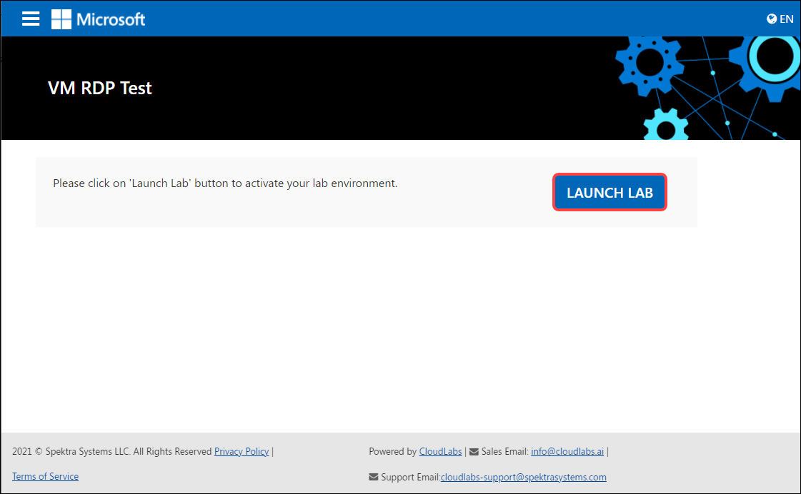
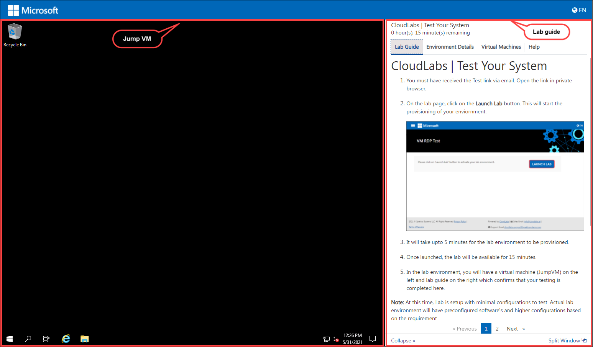

# CloudLabs | Test Your System
		
1. You must have received the Test link via email. Open the link in private browser.

2. On the lab page, click on the **Launch Lab** button. This will start the provisioning of your enviornment.

  

3. It will take upto 5 minutes for the lab environment to be provisioned.

4. Once launched, the lab will be available for 15 minutes. 

5. In the lab environment, you will have a virtual machine (JumpVM) on the left and lab guide on the right which confirms that your testing is completed here. 

  

> **Note:** At this time, Lab is setup with minimal configurations to test. Actual lab environment will have preconfigured software’s and higher configurations based on the requirement.

6. In case if you have issues with the VM, please turn to next page.
